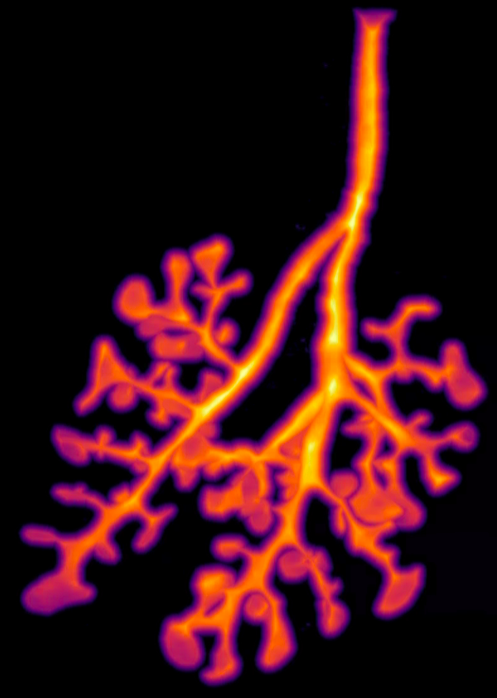

# SkelePlex v2

[](https://github.com/MalteMederacke/skeleplex-v2/raw/main/LICENSE)
[](https://pypi.org/project/skeleplex-v2)
[](https://python.org)
[](https://github.com/MalteMederacke/skeleplex-v2/actions/workflows/ci.yml)
[](https://codecov.io/gh/MalteMederacke/skeleplex-v2)

**A Python toolkit for analyzing complex biological network structures**

SkelePlex is a comprehensive image analysis tool designed to extract quantitative measurements from complex biological networks while preserving their morphological context. It specializes in analyzing branching structures such as:

- 🫁 **Bronchial trees** - Respiratory system analysis
- 🩸 **Vasculature** - Blood vessel networks  
- 🧠 **Axonal networks** - Neural connectivity
- 🌱 **Xylem structures** - Plant vascular systems

## Key Features

- **Hierarchical graph construction** from segmentation images
- **Interactive curation** with custom viewer tools
- **Comprehensive measurements**: branch length, angles, generation, diameter, tissue thickness
- **Scalable processing** with parallelized, lazy operations for large datasets
- **Multi-format support** including `.zarr` for out-of-core computation

## Table of Contents

- [Installation](#installation)
- [Workflow Overview](#workflow-overview)
- [Examples](#examples)
- [Development](#development)
- [Citation](#citation)
- [License](#license)


## Installation

### Basic Installation

```bash
pip install skeleplex-v2
```

### Full Installation (with viewer and visualization tools)

```bash
pip install "skeleplex-v2[cellier,viz]"
```

### System Requirements

- Python 3.11+
- For large datasets: Sufficient RAM or `.zarr` format support
- For interactive viewing: OpenGL-compatible graphics


## Workflow Overview

### 1. Segmentation Input

Start with a semantic segmentation where `1` represents foreground (network) and `0` represents background. SkelePlex supports various formats including `.zarr` for out-of-memory computations.

<p align="center">

<br><i>Input: Binary segmentation of biological network</i>
</p>

### 2. Distance Field Computation

Transform the segmentation into a normalized distance field using a spherical max distance kernel. Each voxel value represents the normalized distance to the background.

<p align="center">

<br><i>Distance field representation</i>
</p>

### 3. Skeleton Prediction

Apply the multiscale SkelePlex UNet to predict skeleton centerlines from the distance field image.

<p align="center">

<br><i>AI-predicted skeleton centerlines</i>
</p>

### 4. Graph Construction & Curation

- Construct hierarchical graph with nodes at branch points
- Fit splines to connecting edges
- Use the interactive viewer for manual curation and quality control

<p align="center">

<br><i>Final curated skeleton graph</i>
</p>

### 5. Data Analysis

There are many ways to analyse the graphs. We have implemented:
 - Measuring of branch length, diameter, branch angle and number of tips connected to the branch
 
 To measure branch diameters we:

 - Extract orthogonal image sections along each branch
 - Process and filter these image sections
 - Extract the section area and determine branch thickness
 - An automatized way to differentiate between the branch lumen and its surrounding wall thickness if the tissue and not the lumen was segmented

## Examples


We provide a couple of examples on how to use SkelePlex, see the [`examples/`](examples/) directory:

### Segmentation to graph
This is the best starting point.
- [`Create a toy segmentation`](examples/segmentation_to_graph/create_example_data.py) 
- [`Segmentation to graph in memory`](examples/segmentation_to_graph/segmentation_to_graph_memory.py) 
- [`Segmentation to graph lazyly`](examples/segmentation_to_graph/lazy/tutorial.md) 


### Viewer app to inspect and curate graphs
- [`Basic viewer usage`](examples/viewer/basic_viewer_usage.py) - Usage of the skeleton viewer
- [`Add your custom widget`](examples/viewer/add_custom_widget.py)

### Measure all sorts of network properties
- [`Extract orthogonal slices along each branch`](examples/measurements/extract_orthogonal_slices.py) - Important to measure branch diameters
- [`Measure the branch diameters`](examples/measurements/extract_orthogonal_slices.py)
- [`Measure more and export`](examples/measurements/measure_and_export.py)

### Train your lumen classifier
If you segmented the tissue of a branch and are interested to measure tissue thickness and the lumen diameter, you can train a lumen classifier to automate that step. 

- [`Create trainings data from orthogonal slices`](examples/measurements/lumen_classifier/create_lumen_classifier_trainings_data.py)
- [`Set up trainings data for training`](examples/measurements/lumen_classifier/create_lumen_classifier_trainings_data.py)
- [`Train your classifier`](examples/measurements/lumen_classifier/train_lumen_classifier.py)


## Development

### Development Installation

1. **Fork and Clone**
   ```bash
   git clone https://github.com/YourUsername/skeleplex-v2.git
   cd skeleplex-v2
   ```

2. **Create Environment** (recommended)
   ```bash
   conda create -n skeleplex python=3.11
   conda activate skeleplex
   ```

3. **Install in Development Mode**
   ```bash
   pip install -e ".[dev-all]"
   ```

4. **Set up Pre-commit Hooks**
   ```bash
   pre-commit install
   ```

### Running Tests

```bash
# Run all tests
pytest


# Run specific test module
pytest tests/graph/test_skeleton_graph.py
```

### Code Style

We use `ruff` for linting and formatting:

```bash
# Format code
ruff format .

# Check for issues
ruff check .
```

## Technical Notes

### Coordinate System
- All coordinates are transformed to physical units (µm)
- Input images should be isotropic for optimal results

### Platform Differences
For computing signed distances to mesh surfaces:
- **Unix/Linux/macOS**: Uses `pysdf` (better performance)
- **Windows**: Uses `igl` (consistent results)

Both approaches yield equivalent results and only affect synthetic data generation.

## Citation

If you use SkelePlex in your research, please cite:

```bibtex
@article{mederacke2025emergence,
  title={The emergence of the fractal bronchial tree},
  author={Mederacke, Malte and Yamauchi, Kevin A and Doumpas, Nikolaos and Schaumann, Laura and Sperl, Jonathan and Weikert, Thomas and Dane, D Merrill and Hsia, Connie CW and Pradella, Maurice and Bremerich, Jens and others},
  journal={BioRxiv},
  pages={2025--01},
  year={2025},
  publisher={Cold Spring Harbor Laboratory}
}
```

## License

This project is licensed under the BSD-3-Clause License - see the [LICENSE](LICENSE) file for details.

## Support

- **Issues**: [GitHub Issues](https://github.com/KevinYamauchi/skeleplex-v2/issues)
- **Discussions**: [GitHub Discussions](https://github.com/KevinYamauchi/skeleplex-v2/discussions)
- **Email**: [malte.mederacke@ethz.ch]

---
