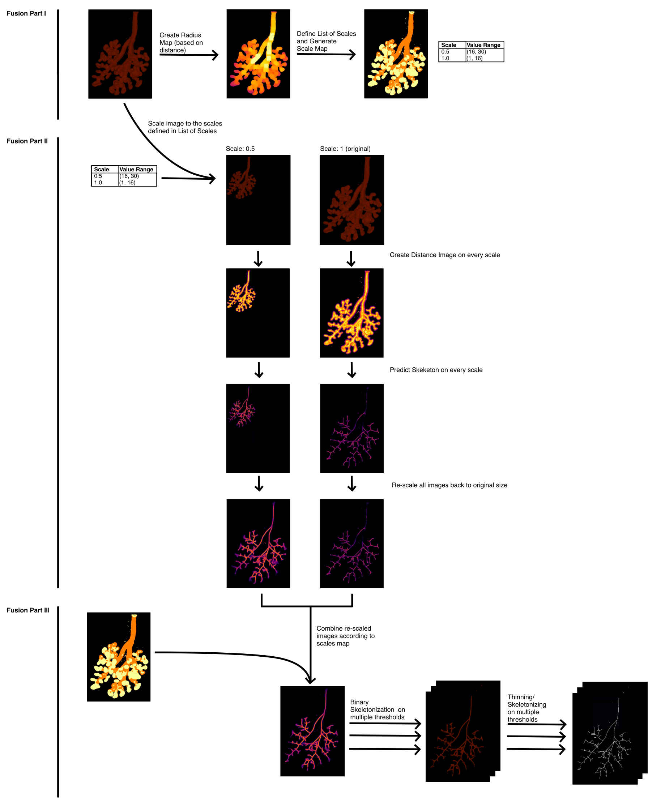

# Fusion Algorithm

## Introduction

As neural networks are not inherently scale-resistant and the human bronchial tree spans across multiple scales, the SkelePlex predictions are better in certain regions of the lung. To address this issue, the fusion algorithm was developed. The main idea is to up- and down-scale the original lung image to various scales to ensure that every region of the bronchial tree is processed at the scale-range where SkelePlex performs best. The final output is a thinned skeleton, obtained from a skeleton prediction that was fused together from multiple skeleton predictions on various scales. The following image summarizes the workflow of the fusion algorithm:



## Required Changes and Uploading Files

The following elements in the python scripts need to be adapted to the use-case, the elements are tagged with an `ADAPT HERE` statement.

* **Image Prefix:** Is used to save the files generated in the fusion pipeline with a specified prefix (e.g., LungXX).
* **Scale Ranges:** This is a dictionary that is used to define the scales and ranges of radii covered in the scale map (used to assign which areas are pulled from which resized skeleton prediction).
* **Image Segmnetation Path:** Adapt this file path according to its location on Euler. The file should be a `.zarr` of the image segmentation (i.e., binary mask of the airways).
* **Thresholds List:** This list is used to specify a set of thresholds that will be applied to threshold the image in fusion part III. 


Once the above adaptations were made, upload the files to Euler using: `rsync -av /path/to/file/local ustername@euler.ethz.ch:/path/to/folder/euler`

Ensure to create a new folder to store the fusion python files and a data folder within. The file structure should follow this scheme:

```bash
fusion/
├── data/
│   ├── image segmentataion
│   └── zarr output files
└── python scripts
└── submission scripts
└── job output files
```

## Virtual Environment for Fusion Pipeline on Euler
To get started with Euler for SkelePlex also see: [Running SkelePlex on ETH Euler Cluster](https://github.com/kevinyamauchi/skeleplex-v2/blob/a13eb36f8a688f01c053e4e3ab636ae9e5aaef64/docs/euler.md)

Create a new virtual environment using these commands:
    1. Load module stack with pre-installed cuda: `module load stack/2024-06 cuda/12.8.0`
    2. Load module stack with pre-installed packages: `module load stack/2024-06 python/3.11.6`
    3. Create new virtual environment called skeleplexenv: `python -m venv --system-site-packages skeleplexenv`
    4. Activate your new virtual environment called skeleplexenv: `source skeleplexenv/bin/activate`
    5. Install skeleplex and cuda into that virtual environment: `pip install ".[torch]" cupy-cuda12x"`


## Submission Scripts

For each python file / job to submit, create a submission script (e.g., 1_fusion_submission.sh). Use the following recommendations for each intermediary step of fusion:

| job-name   | time      | cpus-per-task | mem-per-cpu    | gpu          |
|------------|-----------|----------------|----------------|---------------|
| 1_fusion   | 06:00:00  | 4              | 64 GB      | rtx_4090:4    |
| 2_1_fusion | 03:00:00  | 4              | 20 GB      | —             |
| 2_2_fusion | 36:00:00  | 4              | 30 GB      | rtx_4090:4    |
| 2_3_fusion | 36:00:00  | 4              | 30 GB      | rtx_4090:4    |
| 2_4_fusion | 02:00:00  | 4              | 5 GB       | —             |
| 3_1_fusion | 03:00:00  | 4              | 100 GB     | —             |
| 3_2_fusion | 03:00:00  | 4              | 55 GB      | —             |

To achieve correct processing on multiple scales, include `job-index` and `job-index-offset` variables. The `job-index` is defined by the numbers in the array submsssion of the jobs (see [Fusion II submissions](#fusion-ii)) and the `job-index-offset` is used to achieve the negative scale numbers. In the python scripts the scale number is defined as the subtraction of the `job-index-offset` from the `job-index`.  E.g., by submitting the jobs with the array 0-3 and setting the `job-index-offset` to 3, the scales -3, -2, -1 and 0 are achieved. Find an examplary job submission script for fusion part II below:

```bash
#!/bin/bash

#SBATCH --job-name=2_2_fusion
#SBATCH --time=03:00:00
#SBATCH --ntasks=1
#SBATCH --cpus-per-task=4
#SBATCH --mem-per-cpu=30G 
#SBATCH --gpus=rtx_4090:1    
#SBATCH --output=2_2_fusion_%j.out

python 2_1_fusion.py --workers 6 --job-index $SLURM_ARRAY_TASK_ID --job-index-offset 3

echo "Job completed: $(date)"
```

Fusion part III also requires specification of the `job-index`, it is used as a positional argument to access the different thresholds saved in the thresholds list (e.g, if the thresholds list contains 5 different thresholds submit the job as an array 0-4). For correct implementation, include `--job-index $SLURM_ARRAY_TASK_ID` in your submission script.

## Submitting Fusion Jobs on Euler
To string the jobs together on Euler, submit them as dependencies by replaceing the capital letters `FUSION_X` with the respective Euler Job-ID.

### Fusion Part I
`sbatch 1_fusion_submission.sh`

### Fusion Part II
Jobs are submitted as arrays to process the different scales defined in the scales list.

`sbatch --dependency=afterok:FUSION1 --array=0-3 2_1_fusion_submission.sh`

`sbatch --dependency=afterok:FUSION2_1 --array=0-3 2_2_fusion_submission.sh`

`sbatch --dependency=afterok:FUSION2_2 --array=0-3 2_3_fusion_submission.sh`

`sbatch --dependency=afterok:FUSION2_3 --array=0-3 2_4_fusion_submission.sh`


### Fusion Part III
Fusion 3.2 is submitted as an array to process different thresholds for the binary skeleton generation. Adapt the submitted array according to the number of thresholds you have specified in `3_2_fusion.py`.

`sbatch --dependency=afterok:FUSION2_4 3_1_fusion_submission.sh`

`sbatch --dependency=afterok:FUSION3_1 --array=0-4 3_2_fusion_submission.sh`

